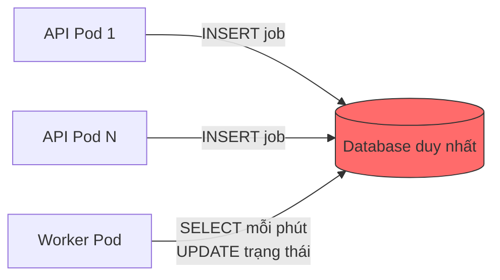
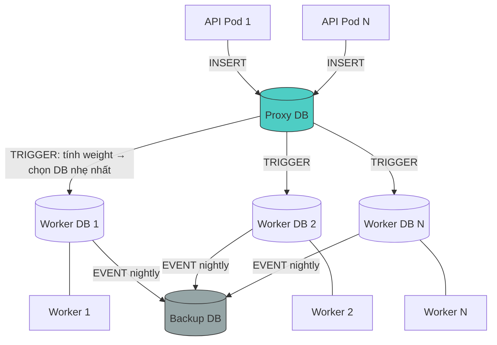
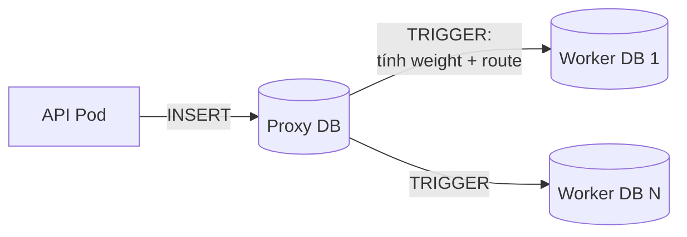
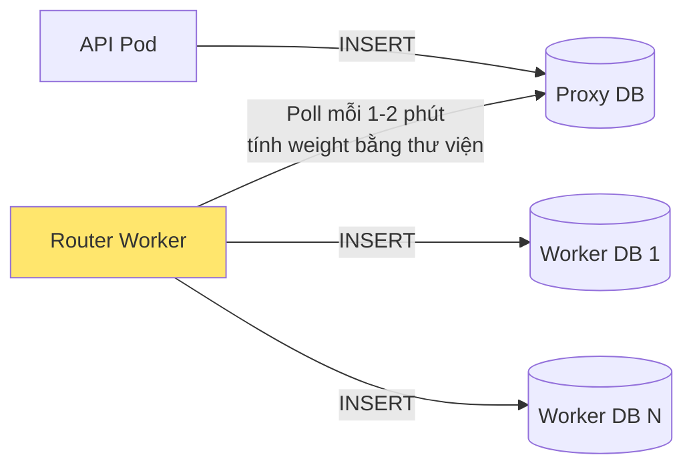
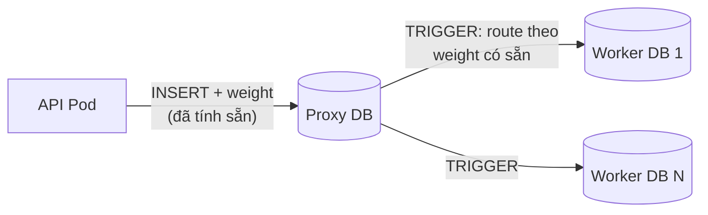

# Solution Design: Cân bằng tải Job Scheduling System

---

## 1. Hệ thống hiện tại



- API Pods nhận yêu cầu từ khách hàng → INSERT job vào một database duy nhất
- Worker quét database mỗi phút, lấy job mới theo ID tăng dần, đưa vào Quartz.NET xử lý
- Các loại job: chạy 1 lần ngay, chạy 1 lần theo lịch, recurring theo interval, cron phức tạp
- Khi Worker restart → UPDATE trạng thái toàn bộ bản ghi hợp lệ để chạy lại

---

## 2. Các vấn đề hiện tại

### 2.1 Fatal Error khi restart Worker

- Worker restart → UPDATE status toàn bộ bản ghi hợp lệ trong 1 lệnh
- Hiện tại **250,000 bản ghi** → quét toàn bộ bảng → vượt `innodb_lock_wait_timeout` (50s) → **fatal**
- Số bản ghi tích lũy theo thời gian, tình trạng sẽ ngày càng nghiêm trọng hơn

| Số bản ghi | Thời gian UPDATE full table | Kết quả |
|---|---|---|
| ≤ 50,000 | ~5-10s | ✅ An toàn |
| 250,000 (hiện tại) | ~40-90s | ❌ Fatal |

### 2.2 Workload không đều giữa các Worker

- Các tenant có số lượng job khác nhau, tỷ lệ job 1 lần vs job định kỳ cũng khác nhau
- Nếu chia theo tenant → tenant lớn dồn 1 database → Worker đó quá tải, Worker khác rảnh
- Nếu chia đều số bản ghi → Worker chứa nhiều recurring (mỗi 5 phút = 288 lần/ngày) bận gấp nhiều lần Worker chứa toàn job 1 lần
- Vẫn có thể gặp lại fatal nếu database bị lệch

### 2.3 Job chạy trùng khi scale Worker

- Nếu chỉ scale thêm Worker Pod cùng đọc 1 database → cùng SELECT job → **1 job chạy nhiều lần**
- 1 tenant chạy ở nhiều Worker không sao, miễn **1 job không bị select bởi nhiều Worker**

---

## 3. Ràng buộc

- ❌ Không sửa code Worker (Quartz.NET) — quá phức tạp
- ⚠️ Hạn chế tối đa sửa code API Pod
- ✅ Có thể tạo database trung gian, worker mới, trigger, event, script

---

## 4. Đề xuất giải pháp

### 4.1 Archive dữ liệu cũ (Nightly Cleanup)

> Áp dụng cho **tất cả** các giải pháp bên dưới — giải quyết triệt để vấn đề fatal error.

- Tạo bảng backup **giống hệt** bảng jobs
- Hằng ngày lúc **1-2h sáng**, chạy job chuyển dữ liệu không bao giờ được update nữa sang bảng backup:
  - Job one-time đã completed
  - Job recurring/cron đã qua end date
  - Job bị cancel/disabled
- Bảng backup phục vụ **trace lại lịch sử** khi cần
- Mỗi Worker DB luôn giữ **≤ 50,000 rows** → UPDATE khi restart an toàn (~5-10s)

### 4.2 Database Sharding + Cân bằng tải

- Chia 1 database thành **N database** (Worker DB), mỗi Worker quản lý 1 database riêng → **không bị trùng job**
- Tạo **database trung gian** (Proxy DB) giữ nguyên schema gốc, code API Pod chỉ cần đổi connection string
- Proxy DB nhận INSERT từ API Pod → **phân phối job** sang Worker DB phù hợp
- Cần **thuật toán cân bằng** đảm bảo:
  - Các Worker DB có **workload thực tế** tương đương nhau
  - Cân bằng cả **job 1 lần** lẫn **job định kỳ**
  - Cả số bản ghi lẫn khối lượng xử lý đều đều

### 4.3 Thuật toán cân bằng: Weighted Workload Score

Gán **trọng số** cho mỗi job theo số lần chạy thực tế trong 24 giờ:

| Loại Job | Weight | Ví dụ |
|---|---|---|
| One-time | `1` | 1 |
| Scheduled | `1` nếu trong 24h, `0.1` nếu ngoài | 1 |
| Recurring | `86400 / interval_giây` | Mỗi 5 phút → **288** |
| Cron | Số lần trigger / 24h | `0 * * * *` → **24** |

**Routing:** Mỗi job mới → chọn Worker DB có **tổng weight thấp nhất** → INSERT vào đó.

**Weight tracking incremental — O(1), không quét bảng:**

| Sự kiện | Thao tác |
|---|---|
| Job mới INSERT | `total_weight += weight(job)` |
| Job bị archive | `total_weight -= weight(job)` |

### Kiến trúc tổng quan (áp dụng cho tất cả phương án)



---

## 5. So sánh các phương án triển khai

### Phương án A: Pure MySQL (Trigger + Event)



| | |
|---|---|
| **Mô tả** | Tính weight + route hoàn toàn bằng MySQL function/trigger |
| **Ưu điểm** | Không cần thêm service. Không sửa code API/Worker. Không có độ trễ |
| **Nhược điểm** | Tính Cron weight bằng pure SQL **khó và không chính xác** (MySQL không có thư viện parse cron). Trigger không hỗ trợ dynamic schema name (phải hardcode IF/ELSEIF). Khó debug và maintain |
| **Sửa code** | Không |
| **Độ trễ** | 0 |

---

### Phương án B: Router Worker Service ⭐ Khuyến nghị



| | |
|---|---|
| **Mô tả** | API Pod INSERT vào Proxy DB như bình thường. Tạo **1 Worker mới** (Router Worker) chỉ để quét Proxy DB, dùng **thư viện** (C#: Cronos/NCrontab) tính weight chính xác, rồi INSERT vào Worker DB tương ứng |
| **Ưu điểm** | Tính Cron weight **chính xác 100%** bằng thư viện. Dễ debug, log, monitor. Dễ mở rộng logic sau này. Sửa code API Pod tối thiểu (chỉ đổi connection string) |
| **Nhược điểm** | Thêm 1 service cần maintain. Có **độ trễ 1-2 phút** giữa INSERT và route |
| **Sửa code** | Không sửa API Pod (chỉ đổi config). Viết mới Router Worker |
| **Độ trễ** | 1-2 phút (chấp nhận được vì thực tế khách hàng không thiết lập job chạy khoảng cách ngắn hơn) |

---

### Phương án C: Sửa code API Pod tính weight



| | |
|---|---|
| **Mô tả** | Sửa code API Pod để tính weight trước khi INSERT. Proxy DB chỉ đọc weight có sẵn → route, không cần tính toán |
| **Ưu điểm** | Không có độ trễ. Database trung gian đơn giản (chỉ route, không tính) |
| **Nhược điểm** | **Phải sửa tất cả code INSERT ở API Pod** — rủi ro cao, mất thời gian. Mỗi lần thay đổi logic weight phải deploy lại API Pod |
| **Sửa code** | Sửa nhiều ở API Pod |
| **Độ trễ** | 0 |

---

### Phương án D: Auto-scale Pod + Code cân bằng tải

| | |
|---|---|
| **Mô tả** | Giống hệ thống mail hiện tại — dùng code để tự động cân bằng tải giữa các Worker Pod, tự tăng/giảm pod |
| **Ưu điểm** | Tự động hoàn toàn. Có thể tự tăng/giảm pod. Linh hoạt |
| **Nhược điểm** | **Khá phức tạp** và nhiều rủi ro chưa care hết. Database **vẫn cần chia** lại để tránh fatal khi restart. Khó test hết edge case |
| **Sửa code** | Sửa nhiều |
| **Độ trễ** | 0 |

---

### Bảng tổng hợp

| Tiêu chí | A: Pure MySQL | B: Router Worker ⭐ | C: Sửa API Pod | D: Auto-scale |
|---|---|---|---|---|
| Sửa code API Pod | ❌ Không | ❌ Không | ⚠️ Nhiều | ⚠️ Nhiều |
| Sửa code Worker | ❌ Không | ❌ Không | ❌ Không | ⚠️ Có |
| Tính Cron weight | ⚠️ Ước tính | ✅ Chính xác | ✅ Chính xác | ✅ Chính xác |
| Độ trễ | 0 | 1-2 phút | 0 | 0 |
| Độ phức tạp | Trung bình | **Thấp** | Trung bình | **Cao** |
| Rủi ro | Thấp | **Thấp** | Trung bình | Cao |
| Thêm Worker DB | Thêm IF/ELSEIF | Thêm config | Thêm trigger | Tự động |
| Maintain | Khó debug | **Dễ** | Trung bình | Phức tạp |

---

## 6. Khó khăn

- Tìm thuật toán cân bằng **hợp lý mà ít rủi ro**
- Cân bằng đồng thời **2 chiều**: số bản ghi đều (database cân bằng) + workload thực đều (worker cân bằng)
- Job 1 lần chạy xong → Worker rảnh, job định kỳ chạy mãi → Worker bận — cần weight phản ánh đúng

---

## 7. Migration dữ liệu hiện tại

Dùng thuật toán **Greedy Partition** (đã được chứng minh ≤ 4/3 × tối ưu):

```
1. Tính weight cho tất cả job active hiện tại
2. Sắp xếp giảm dần theo weight
3. Lần lượt gán mỗi job vào Worker DB có tổng weight thấp nhất
```

Cần **stop workers** trong quá trình migration.

---

## 8. Scale-out (thêm Worker DB mới)

```
1. Tạo Worker DB mới + thêm config (total_weight = 0)
2. Thuật toán tự động ưu tiên DB mới (vì weight = 0) → tự cân bằng dần
3. Không cần sửa lại thuật toán
4. Cần thêm Worker Pod tương ứng
5. Optional: chạy rebalance script nếu muốn cân bằng nhanh hơn
```

---

## 9. Kết quả mong đợi

| Vấn đề | Trước | Sau |
|---|---|---|
| Fatal error khi restart | ❌ 250k rows → timeout | ✅ ≤50k rows → 5-10s |
| Job chạy trùng | ❌ Nhiều worker đọc cùng DB | ✅ Mỗi worker 1 DB riêng |
| Workload không đều | ❌ Chia theo tenant/số bản ghi | ✅ Chia theo weight thực tế |
| Thêm worker mới | ❌ Phải chia lại thủ công | ✅ Tự cân bằng |
| Dữ liệu lịch sử | ❌ Tích lũy trong bảng chính | ✅ Archive sang backup, trace khi cần |

---

## 10. Các bước triển khai

| # | Bước | Ảnh hưởng |
|---|---|---|
| 1 | Tạo Proxy DB + Worker DBs + Backup DB (clone schema) | Không downtime |
| 2 | Phát triển Router Worker (hoặc trigger/event tùy phương án) | Không downtime |
| 3 | Tạo nightly archive event | Không downtime |
| 4 | Chạy migration script chia dữ liệu hiện tại | **Cần stop workers** |
| 5 | Đổi connection string API Pod → Proxy DB | **Cần deploy API** |
| 6 | Đổi connection string mỗi Worker → Worker DB riêng | **Cần restart workers** |
| 7 | Monitor & tune | Không downtime |
